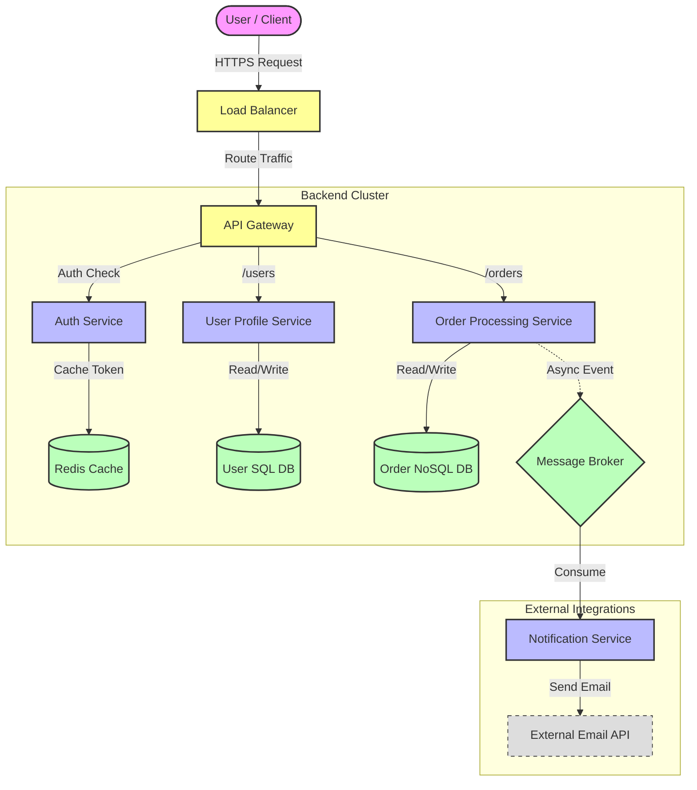

```mermaid
graph TD
    %% Define Styles
    classDef client fill:#f9f,stroke:#333,stroke-width:2px;
    classDef gateway fill:#ff9,stroke:#333,stroke-width:2px;
    classDef service fill:#bbf,stroke:#333,stroke-width:2px;
    classDef db fill:#bfb,stroke:#333,stroke-width:2px;
    classDef external fill:#ddd,stroke:#333,stroke-dasharray: 5 5;

    %% Nodes
    User([User / Client]) -->|HTTPS Request| LB[Load Balancer]
    LB -->|Route Traffic| Gateway[API Gateway]

    subgraph "Backend Cluster"
        Gateway -->|Auth Check| Auth[Auth Service]
        Gateway -->|/users| UserSvc[User Profile Service]
        Gateway -->|/orders| OrderSvc[Order Processing Service]
        
        Auth -->|Cache Token| Redis[(Redis Cache)]
        UserSvc -->|Read/Write| UserDB[(User SQL DB)]
        OrderSvc -->|Read/Write| OrderDB[(Order NoSQL DB)]
        
        OrderSvc -.->|Async Event| Kafka{Message Broker}
    end

    subgraph "External Integrations"
        Kafka -->|Consume| NotifSvc[Notification Service]
        NotifSvc -->|Send Email| EmailProvider[External Email API]
    end

    %% Apply Styles
    class User client;
    class LB,Gateway gateway;
    class Auth,UserSvc,OrderSvc,NotifSvc service;
    class Redis,UserDB,OrderDB,Kafka db;
    class EmailProvider external;
```
